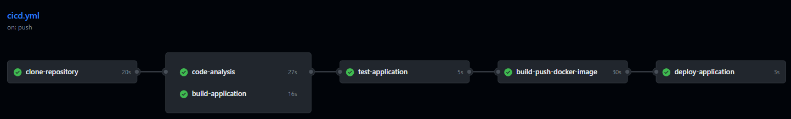
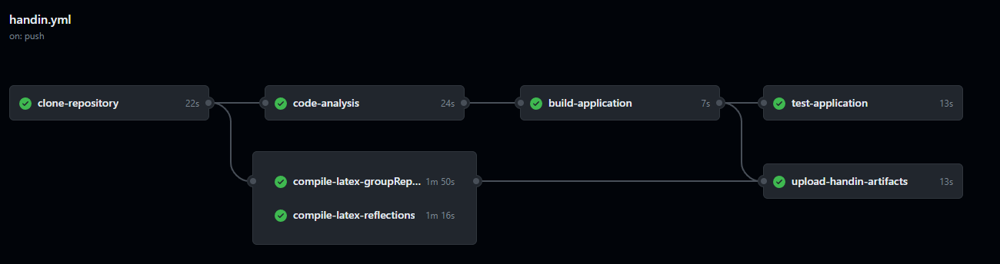
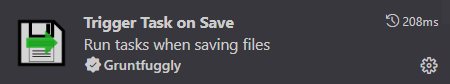
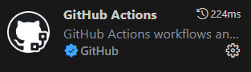

# Advanced Software Architecture and Analysis Portfolio Template

- [Introduction](#introduction)
  - [.github](#github)
    - [CI/CD Workflow](#cicd-workflow)
    - [Hand in Workflow](#hand-in-workflow)
  - [.vscode](#vscode)
  - [Report](#report)
  - [Src](#src)
- [Running the Industry 4.0 Production Platform](#running-the-industry-40-production-platform)
  - [Prerequisites](#prerequisites)
  - [Quick Start](#quick-start)
  - [System Architecture](#system-architecture)
  - [How the System Works](#how-the-system-works)
  - [Factory Simulation](#factory-simulation)
  - [Service Endpoints](#service-endpoints)
  - [Monitoring and Logs](#monitoring-and-logs)
  - [Testing the System](#testing-the-system)
  - [Stopping the System](#stopping-the-system)
- [Compiling Latex](#compiling-latex)
  - [Option 1: LaTeX Workshop + TeX Live](#option-1-latex-workshop--tex-live)
    - [Extension](#extension)
    - [Link to download TeX Live](#link-to-download-tex-live)
  - [Option 2: Trigger Task on Save + Docker](#option-2-trigger-task-on-save--docker)
    - [Compilation of latex on save](#compilation-of-latex-on-save)
  - [Option 3: Overleaf](#option-3-overleaf)
- [Recommended VSCode Extension](#recommended-vscode-extension)

## Introduction
This repository serves as a template for students of Advanced Software Engineering to structure their portfolio project.

Below is the detailed overview of the repository structure:

<pre>
.
├── .github/
│   └── workflows/
│       ├── ci-cd.yml
│       └── handin.yml
├── .vscode/
│   ├── settings.json
│   └── tasks.json
├── Report/
│   ├── GroupTemplate/
│   └── ReflectionsTemplate/
├── Src/
└── .gitignore
</pre>

## .github
This folder contains template workflows designed for CI/CD processes and for generating the final submission artifacts.

### CI/CD Workflow
The CI/CD workflow is split into several jobs:



- **Clone repository**: Clones the repository, creates an artifact from it, and then uploads this artifact, ensuring consistency across all jobs.
- **Code analysis**: Utilize this job for linting or any other static code analysis tools you'd like to incorporate.
- **Build application**: Compile the source code. After compiling, the artifact is uploaded for easy accessibility, aiding in debugging and local testing.
- **Test application**: Run tests that require the code to be compiled. This step downloads the compiled artifact created in the previous step.
- **Build and push image**: Builds an image using a specified `DockerFile` and pushes the image to the GitHub container registry specific to the repository owner.
- **Deploy application**: Can be used to deploy the image(s) generated during the workflow onto your virtual machines.

### Hand in Workflow
The hand-in workflow includes some of the jobs from the CI/CD workflow and some additional ones:



- **Compile latex groupReport**: This job compiles the latex source files for the group report and upload the output as an artifact.
- **Compile latex groupReport**: This job compiles the latex source files for the reflections document and upload the output as an artifact.
- **Upload hand-in artifacts**: This job creates a zip file containing the Group Report, the Reflections Document, the source code, and any build artifacts. The zip can be downloaded by navigating to Repository > Actions > The completed hand-in workflow as shown in the image below.


### Report
This directory contains the latex source files essential for the group report and the reflections document.

The directory latexUtils contains scripts for compiling LaTeX locally using docker, you do not need to change anything in these files, but you are welcome to do so if you want to.

### Src
This folder is intended for organizing and storing all your source code. You decide on the structure but please keep everything source code related inside `./src`.
You are allowed to have your DockerFiles at root level for build context reasons, as the example DockerFile provided.

## Running the Industry 4.0 Production Platform

This project implements an Industry 4.0 Production Platform demonstrating availability tactics including **sensor-based monitoring**, fault detection, and automatic failover at the sensor level.

### Scope

**What's Included:**
- ✅ **Three sensor families**: Temperature, Level, and Quality (pH, color, weight)
- ✅ **Two-tier health model**: Sensor status → Factory health
- ✅ **Factory health bands**: Operational (≥80%), Degraded (50-79%), Critical (20-49%), Down (<20%)
- ✅ **Automatic failover**: Orders reassigned when factory health degrades

**What's NOT Included (by design):**
- ❌ No actuators (valves, pumps, motors)
- ❌ No pressure or flow sensors
- ❌ No production lines or recipes
- ❌ No recipe-based validation

### Prerequisites

- **Docker** (v20.10+) and **Docker Compose** (v2.0+)
- At least 4GB of available RAM
- Ports 3000, 8000, 1883, 5432, 27018, 9092 available

### Quick Start

1. **Navigate to the source directory:**
   ```bash
   cd src
   ```

2. **Start all services:**
   ```bash
   docker-compose up -d
   ```

3. **Wait for services to initialize** (approximately 30-60 seconds for all health checks to pass):
   ```bash
   docker-compose ps
   ```

4. **Verify the system is running:**
   ```bash
   # Check PMS health
   curl http://localhost:3000/health
   
   # Check MMS health
   curl http://localhost:8000/health
   
   # Check all factory health
   curl http://localhost:8000/api/factories
   ```

5. **Open the Dashboard:**
   Open your browser and navigate to: **http://localhost:8080**

### Dashboard

The platform includes a real-time monitoring dashboard that displays:

- **System Overview**: Total factories, operational count, total sensors, active orders
- **Factory Health Cards**: Each factory shows:
  - Health percentage with color-coded status bar
  - Sensor counts (OK/Warning/Failed)
  - Visual sensor grid by type (Temperature, Level, Quality)
- **Recent Orders**: Latest orders with status and assignment
- **Auto-refresh**: Updates every 2 seconds


### System Architecture

The platform consists of the following microservices:

| Service | Technology | Port | Description |
|---------|------------|------|-------------|
| **Dashboard** | Node.js/Express | 8080 | Real-time monitoring UI |
| **Order Generator** | Node.js | - | Automated order creation and intelligent failover management |
| **PMS** (Production Management Service) | Node.js/Express | 3000 | Order management, factory scheduling, gRPC server |
| **MMS** (Monitoring & Maintenance Service) | Python/FastAPI | 8000 | Sensor monitoring, factory health calculation, failover triggers |
| **Bridge** | Node.js | - | MQTT to Kafka message bridge for sensor data |
| **Factory Simulators** (4 instances) | Node.js | - | Simulate 20 sensors per factory (temperature, level, quality) |
| **PostgreSQL** | Database | 5432 | Orders, factory assignments, activity logs |
| **MongoDB** | Database | 27018 | Sensor readings, factory health status, events, order requests |
| **Kafka** | Message Broker | 9092 | Event streaming backbone |
| **Mosquitto** | MQTT Broker | 1883 | Sensor data ingestion |

### How the System Works

The Industry 4.0 Production Platform implements a **two-tier health model**: Sensor Level → Factory Level.

#### Data Flow
```
                                                    ┌────────────┐
                                                    │  MongoDB   │
                                                    │  - Events  │
                                                    │  - Orders  │
                                                    │  - Sensors │
                                                    └─────▲──────┘
                                                          │
┌─────────────┐    MQTT     ┌─────────┐    Kafka    ┌─────┴─────┐
│  Factories  │ ──────────► │ Bridge  │ ──────────► │    MMS    │
│  (Sensors)  │             └─────────┘             └─────┬─────┘
└─────────────┘                                           │ gRPC
                                                          ▼
┌─────────────┐                                    ┌─────────────┐
│   Order     │ ──────────────────────────────────►│     PMS     │
│  Generator  │          HTTP API                  └──────┬──────┘
└─────────────┘                                           │
      │                                                   ▼
      │                                            ┌────────────┐
      └───────────────────────────────────────────►│ PostgreSQL │
              Query Health & Reschedule            │  - Orders  │
                                                    │  - Factory │
                                                    │  - Logs    │
                                                    └────────────┘
```

#### Order Generation & Assignment
The **Order Generator** service automates the production simulation:

1. **Batch Order Creation**: Generates orders in batches every 5 seconds with:
   - Batch size: 1-5 orders per batch (randomly selected)
   - Product types: cola, pepsi, fanta, sprite, water
   - Quantities: 100-1000 units per order
   - Priority levels: 1-5
   - Production time: 5-10 seconds (adjusted by product type)

2. **Multi-Factory Distribution**: Each batch can be distributed across multiple factories:
   - Intelligently assigns orders based on factory health and available capacity
   - Respects factory capacity limits (max 5 orders per OPERATIONAL factory, scales down for DEGRADED factories)
   - Can split a batch across 2-3 factories if the healthiest factory is at capacity

3. **Order Lifecycle**:
   - **Pending**: Order created but not yet assigned
   - **Assigned**: Assigned to a factory with available capacity
   - **In Progress**: Factory begins processing (after 1 second)
   - **Completed**: Order finishes after estimated production time

4. **Load-Based Sensor Effects**:
   - Orders increase factory load, affecting sensor readings
   - Temperature increases: +0 to +5°C based on factory load percentage
   - Quality sensor warnings: +10-20% higher probability under high load
   - Failure rate multiplier: 1 + (load × 2), up to 3× at full capacity

5. **Automatic Failover**: Monitors factory health every 10 seconds:
   - Detects factories in CRITICAL (<50%) or DOWN (<20%) status
   - Retrieves all orders assigned to failing factories
   - Automatically reschedules orders to healthiest available factory
   - Logs all failover operations

This creates a closed-loop simulation where:
- Sensor data → Factory health → Order assignment → Load effects on sensors → Adaptive failover

### Storage Architecture

The platform uses two databases optimized for different purposes:

#### PostgreSQL
Relational data requiring transactional integrity:

| Table | Purpose |
|-------|---------|
| `factories` | Factory registry with `health_percentage` and `status` |
| `orders` | Order management (unchanged) |
| `activity_logs` | System activity audit trail |

**Factories Table Schema:**
| Field | Type | Description |
|-------|------|-------------|
| `id` | VARCHAR | Factory identifier (factory-1, factory-2, etc.) |
| `name` | VARCHAR | Display name |
| `health_percentage` | DECIMAL | Current health % (0-100) |
| `status` | VARCHAR | OPERATIONAL, DEGRADED, CRITICAL, DOWN |
| `updated_at` | TIMESTAMP | Last status update |

**Activity Logs Table Schema:**
| Field | Type | Description |
|-------|------|-------------|
| `id` | SERIAL | Primary key |
| `timestamp` | TIMESTAMP | When the activity occurred |
| `service` | VARCHAR | Service that generated the log (PMS, MMS) |
| `action` | VARCHAR | Action type (CREATE, UPDATE, DELETE, ASSIGN, FAILOVER) |
| `entity_type` | VARCHAR | Entity involved (order, factory) |
| `entity_id` | VARCHAR | ID of the affected entity |
| `details` | JSONB | Additional context and metadata |

#### MongoDB
High-volume sensor data and events:

**Sensor Readings Collection (`sensor_readings`):**
| Field | Type | Description |
|-------|------|-------------|
| `_id` | ObjectId | Document ID |
| `factory_id` | String | Factory identifier |
| `sensor_id` | String | Sensor identifier |
| `sensor_type` | String | temperature, level, or quality |
| `zone` | String | Sensor zone/location |
| `value` | Number | Reading value |
| `unit` | String | Unit of measurement |
| `status` | String | OK, WARNING, FAILED |
| `timestamp` | DateTime | Reading timestamp |

**Factory Health Snapshots Collection (`factory_health`):**
| Field | Type | Description |
|-------|------|-------------|
| `_id` | ObjectId | Document ID |
| `factory_id` | String | Factory identifier |
| `health_percentage` | Number | Health % (0-100) |
| `status` | String | OPERATIONAL, DEGRADED, CRITICAL, DOWN |
| `ok_sensors` | Number | Count of OK sensors |
| `warning_sensors` | Number | Count of WARNING sensors |
| `failed_sensors` | Number | Count of FAILED sensors |
| `total_sensors` | Number | Total sensor count |
| `timestamp` | DateTime | Snapshot timestamp |

**Events Collection (`events`):**
| Field | Type | Description |
|-------|------|-------------|
| `_id` | ObjectId | Document ID |
| `event_type` | String | SENSOR_WARNING, SENSOR_FAILED, HEALTH_CHANGE, FAILOVER |
| `factory_id` | String | Associated factory |
| `severity` | String | INFO, WARNING, CRITICAL |
| `data` | Object | Event-specific payload |
| `timestamp` | DateTime | Event timestamp |

**Order Requests Collection (`order_requests`):**
| Field | Type | Description |
|-------|------|-------------|
| `_id` | ObjectId | Document ID |
| `request_id` | String | Unique request identifier |
| `order_id` | Number | Associated order ID (from PostgreSQL) |
| `action` | String | CREATE, UPDATE, ASSIGN, COMPLETE, CANCEL |
| `order_data` | Object | Order details (product_type, quantity, priority) |
| `assigned_factory` | String | Factory assigned to the order |
| `status` | String | Request status (PENDING, COMPLETED, FAILED) |
| `timestamp` | DateTime | Request timestamp |

**Alerts Severity Mapping:**
| Event | Severity |
|-------|----------|
| Sensor WARNING | INFO |
| Factory DEGRADED | WARNING |
| Factory CRITICAL/DOWN | CRITICAL |

### Sensor-Based Monitoring

#### 1. Sensor Types
Each factory simulates **20 sensors**:
- **6 Temperature Sensors**: Monitor mixing tanks, fermentation vessels, storage
- **6 Level Sensors**: Monitor tank fill levels
- **8 Quality Sensors**: Monitor pH (2), color (2), weight (4)

Sensors publish readings every 1 second via MQTT topics:
- `factory/{id}/sensors/temperature/{sensor_id}`
- `factory/{id}/sensors/level/{sensor_id}`
- `factory/{id}/sensors/quality/{sensor_id}`

#### 2. Sensor Health States
Each sensor has one of three states:
- **OK**: Reading within normal range
- **WARNING**: Reading near threshold limits
- **FAILED**: No reading received (timeout) or completely out of range

**MMS Monitoring Rules:**
| Sensor Type | Rule | Result |
|-------------|------|--------|
| **Temperature** | Missing heartbeat > 5 seconds | FAILED |
| **Temperature** | Value outside 15-30°C (zone-specific) | WARNING/FAILED |
| **Level** | Value outside 20-80% range | WARNING |
| **Level** | Value at 0% or 100%, or implausible jump | FAILED |
| **Quality (pH)** | Value outside 6.5-7.5 | WARNING |
| **Quality (pH)** | Extreme values (<5.0 or >9.0) | FAILED |
| **Quality (Color)** | Value outside 40-60 index | WARNING |
| **Quality (Weight)** | Value outside 490-510g | WARNING |

#### 3. Factory Health Calculation
Factory health is calculated as: **% of sensors in OK state**

| Health % | Factory Status | Description |
|----------|----------------|-------------|
| ≥ 80% | **OPERATIONAL** | Normal production |
| 50-79% | **DEGRADED** | Reduced capacity |
| 20-49% | **CRITICAL** | Minimal operation |
| < 20% | **DOWN** | Cannot produce |

#### 4. Order Assignment Based on Factory Status
PMS uses factory status bands to control order assignment:

| Factory Status | Order Assignment Behavior |
|----------------|---------------------------|
| **OPERATIONAL** | Normal assignment - factory receives new orders |
| **DEGRADED** | Reduced assignment - factory deprioritized for new orders |
| **CRITICAL/DOWN** | Paused - no new orders; existing orders rescheduled elsewhere |

#### 5. Automatic Failover
- When factory health drops to CRITICAL or DOWN, MMS notifies PMS via gRPC
- PMS stops assigning new orders to affected factory
- Existing orders can be reassigned to healthy factories

#### 6. Recovery
- When sensors resume sending readings, they're marked as OK
- Factory health automatically recalculates
- Once health returns to OPERATIONAL, factory becomes available for orders

### Factory Simulation

Each factory simulator generates sensor data for 20 sensors:

#### Sensors Per Factory
| Type | Count | Zones/Names | Normal Range |
|------|-------|-------------|--------------|
| **Temperature** | 6 | mixing-tank-1/2, fermentation-1/2, storage-1/2 | 15-30°C |
| **Level** | 6 | tank-1 through tank-6 | 20-80% |
| **Quality (pH)** | 2 | ph-1, ph-2 | 6.5-7.5 pH |
| **Quality (Color)** | 2 | color-1, color-2 | 40-60 index |
| **Quality (Weight)** | 4 | weight-1 through weight-4 | 490-510g |

#### Factory Configuration

| Factory | Failure Simulation | Failure Probability | Behavior |
|---------|-------------------|---------------------|----------|
| **factory-1** | Disabled | 0% | All 20 sensors always healthy |
| **factory-2** | Disabled | 0% | All 20 sensors always healthy |
| **factory-3** | Enabled | 2% per sensor | Occasional sensor failures |
| **factory-4** | Enabled | 1% per sensor | Rare sensor failures |

#### Customizing Simulation
Modify factory behavior via environment variables in `docker-compose.yml`:

```yaml
environment:
  FACTORY_ID: factory-1
  MQTT_BROKER_URL: mqtt://mosquitto:1883
  SENSOR_READING_INTERVAL_MS: 1000  # Reading frequency (ms)
  SIMULATE_FAILURES: "true"          # Enable/disable sensor failures
  FAILURE_PROBABILITY: 0.02          # Probability of sensor failure (0.0 - 1.0)
```

### Service Endpoints

#### PMS (Production Management Service) - Port 3000
| Endpoint | Method | Description |
|----------|--------|-------------|
| `/health` | GET | Service health check |
| `/api/orders` | GET | List all orders |
| `/api/orders` | POST | Create a new order |
| `/api/orders/:id` | GET | Get order by ID |
| `/api/orders/:id/status` | PATCH | Update order status |
| `/api/factories` | GET | List all factories |
| `/api/factories/:id` | GET | Get factory by ID |
| `/api/factories/:id/status` | PATCH | Update factory status |

#### MMS (Monitoring & Maintenance Service) - Port 8000
| Endpoint | Method | Description |
|----------|--------|-------------|
| `/health` | GET | Service health check |
| `/health/detailed` | GET | Detailed health with dependencies |
| `/api/factories` | GET | All factory health statuses |
| `/api/factories/{factory_id}` | GET | Specific factory health status |
| `/api/sensors/{factory_id}` | GET | All sensors for a specific factory |

### Monitoring and Logs

**View all service logs:**
```bash
docker-compose logs -f
```

**View specific service logs:**
```bash
# Monitor sensor processing and factory health
docker-compose logs -f mms

# Monitor order processing
docker-compose logs -f pms

# Monitor MQTT-Kafka bridge (sensor data)
docker-compose logs -f bridge

# Monitor a specific factory's sensors
docker-compose logs -f factory-1
```

**Check container status:**
```bash
docker-compose ps
```

### Testing the System

#### 1. Create a Test Order
```bash
curl -X POST http://localhost:3000/api/orders \
  -H "Content-Type: application/json" \
  -d '{"product_type": "widget", "quantity": 100, "priority": 1}'
```

#### 2. Check Factory Health
```bash
# All factories
curl http://localhost:8000/api/factories

# Specific factory
curl http://localhost:8000/api/factories/factory-1
```

#### 3. Check Sensor Status
```bash
# All sensors for a factory
curl http://localhost:8000/api/sensors/factory-1
```

#### 4. Simulate Sensor Failures
Factory-3 and Factory-4 are configured with failure simulation enabled. The simulator supports multiple failure modes:

**Failure Modes:**
1. **Heartbeat Miss (No Reading)**: Sensor stops sending readings → FAILED after timeout (default: 5 seconds)
2. **Out-of-Range Values**: Values near threshold limits → WARNING
3. **Far Out-of-Range Values**: Values completely outside valid range → FAILED
4. **Random Drop/Recover**: Sensors randomly fail and recover to demonstrate degraded/recovery states

**How to Trigger Failures:**
- Watch natural failures in factory-3/4 (configured with failure simulation)
- Stop a factory container to simulate complete sensor loss:
  ```bash
  docker-compose stop factory-3
  # Watch MMS detect the timeout and mark factory as DOWN
  docker-compose logs -f mms
  # Restart to see recovery
  docker-compose start factory-3
  ```

**Watch the MMS logs to observe:**
- Sensor status changes (OK → WARNING → FAILED)
- Factory health percentage updates
- Factory status band changes (OPERATIONAL → DEGRADED → CRITICAL → DOWN)
```bash
docker-compose logs -f mms
```

#### 5. Check Order Assignments
```bash
curl http://localhost:3000/api/orders
```

### Stopping the System

**Stop all services:**
```bash
docker-compose down
```

**Stop and remove all data (volumes):**
```bash
docker-compose down -v
```

**Rebuild and restart (after code changes):**
```bash
docker-compose up -d --build
```

## Compiling Latex
You can compile latex source files to PDF locally. Multiple options are available; choose the one you prefer.

### Option 1: LaTeX Workshop Extension + TeX Live
For this option, you'll need the VSCode extension called LaTeX Workshop and the LaTeX Distribution named TeX Live.

While TeX Live does require 6GB! of space, it is a comprehensive collection of nearly all LaTeX packages, it is very user-friendly when paired with LaTeX Workshop.

#### Extension


#### Link to download TeX Live
[TeX Live Official Download](https://www.tug.org/texlive/)

### Option 2: Trigger Task on Save Extension + Docker
This option requires Docker to be installed and running.

Here's how it works:

Inside the `report` directory, there's a docker-compose-latex.yml file.

- This docker-compose file will create bind volumes for the `GroupTemplate` and `ReflectionsTemplate` folders.
- A docker container will start, compile the latex source files, and then exit. The initial process might be a little time-consuming as it needs to create the image. However, afterwards compilations are faster.

To manually run the docker-compose-latex.yml and compile both latex documents, use the command:

- ```docker compose -f report/docker-compose-latex.yml up```

To only compile a specific latex document i.e `GroupReport` or `Reflections` use these commands:

- ```docker compose -f report/docker-compose-latex.yml run latex reflection```
- ```docker compose -f report/docker-compose-latex.yml run latex groupreport```

#### Trigger Task on Save Extension
If you're using VSCode, you can set up your latex files to compile upon saving.
For this, download the `Trigger Task on Save` extension.



This extension will trigger tasks defined in `.vscode/tasks.json` every time you save a `.tex` file.
The task will execute the `docker compose -f report/docker-compose-latex.yml run latex` command with a parameter, depending on the .tex file you are working on.

### Option 3: Overleaf
You are free to import the latex source files into Overleaf.
- If you use this method, you could export the source files from overleaf when done with the report and reflections document.
- By placing the source files into their respective folders `repot/GroupTemplate` and `report/ReflectionsTemplate` you can still take advantage of the handin workflow when creating your final hand in artifact.

## Recommended VSCode Extension

### GitHub Actions

- GitHub workflow documentation
- Auto completion
- Overview of workflow runs directly from VSCode



