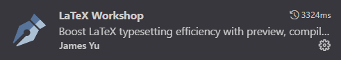

# Advanced Software Architecture and Analysis Portfolio Template

- [Introduction](#introduction)
  - [.github](#github)
    - [CI/CD Workflow](#cicd-workflow)
    - [Hand in Workflow](#hand-in-workflow)
  - [.vscode](#vscode)
  - [Report](#report)
  - [Src](#src)
- [Running the Industry 4.0 Production Platform](#running-the-industry-40-production-platform)
  - [Prerequisites](#prerequisites)
  - [Quick Start](#quick-start)
  - [System Architecture](#system-architecture)
  - [How the System Works](#how-the-system-works)
  - [Factory Simulation](#factory-simulation)
  - [Service Endpoints](#service-endpoints)
  - [Monitoring and Logs](#monitoring-and-logs)
  - [Testing the System](#testing-the-system)
  - [Stopping the System](#stopping-the-system)
- [Compiling Latex](#compiling-latex)
  - [Option 1: LaTeX Workshop + TeX Live](#option-1-latex-workshop--tex-live)
    - [Extension](#extension)
    - [Link to download TeX Live](#link-to-download-tex-live)
  - [Option 2: Trigger Task on Save + Docker](#option-2-trigger-task-on-save--docker)
    - [Compilation of latex on save](#compilation-of-latex-on-save)
  - [Option 3: Overleaf](#option-3-overleaf)
- [Recommended VSCode Extension](#recommended-vscode-extension)

## Introduction
This repository serves as a template for students of Advanced Software Engineering to structure their portfolio project.

Below is the detailed overview of the repository structure:

<pre>
.
├── .github/
│   └── workflows/
│       ├── ci-cd.yml
│       └── handin.yml
├── .vscode/
│   ├── settings.json
│   └── tasks.json
├── Report/
│   ├── GroupTemplate/
│   └── ReflectionsTemplate/
├── Src/
└── .gitignore
</pre>

## .github
This folder contains template workflows designed for CI/CD processes and for generating the final submission artifacts.

### CI/CD Workflow
The CI/CD workflow is split into several jobs:


- **Clone repository**: Clones the repository, creates an artifact from it, and then uploads this artifact, ensuring consistency across all jobs.
- **Code analysis**: Utilize this job for linting or any other static code analysis tools you'd like to incorporate.
- **Build application**: Compile the source code. After compiling, the artifact is uploaded for easy accessibility, aiding in debugging and local testing.
- **Test application**: Run tests that require the code to be compiled. This step downloads the compiled artifact created in the previous step.
- **Build and push image**: Builds an image using a specified `DockerFile` and pushes the image to the GitHub container registry specific to the repository owner.
- **Deploy application**: Can be used to deploy the image(s) generated during the workflow onto your virtual machines.

### Hand in Workflow
The hand-in workflow includes some of the jobs from the CI/CD workflow and some additional ones:


- **Compile latex groupReport**: This job compiles the latex source files for the group report and upload the output as an artifact.
- **Compile latex groupReport**: This job compiles the latex source files for the reflections document and upload the output as an artifact.
- **Upload hand-in artifacts**: This job creates a zip file containing the Group Report, the Reflections Document, the source code, and any build artifacts. The zip can be downloaded by navigating to Repository > Actions > The completed hand-in workflow as shown in the image below.


### Report
This directory contains the latex source files essential for the group report and the reflections document.

The directory latexUtils contains scripts for compiling LaTeX locally using docker, you do not need to change anything in these files, but you are welcome to do so if you want to.

### Src
This folder is intended for organizing and storing all your source code. You decide on the structure but please keep everything source code related inside `./src`.
You are allowed to have your DockerFiles at root level for build context reasons, as the example DockerFile provided.

## Running the Industry 4.0 Production Platform

This project implements an Industry 4.0 Production Platform demonstrating availability tactics including heartbeat monitoring, fault detection, predictive maintenance, and automatic failover.

### Prerequisites

- **Docker** (v20.10+) and **Docker Compose** (v2.0+)
- At least 4GB of available RAM
- Ports 3000, 8000, 1883, 5432, 27017, 9092 available

### Quick Start

1. **Navigate to the source directory:**
   ```bash
   cd src
   ```

2. **Start all services:**
   ```bash
   docker-compose up -d
   ```

3. **Wait for services to initialize** (approximately 30-60 seconds for all health checks to pass):
   ```bash
   docker-compose ps
   ```

4. **Verify the system is running:**
   ```bash
   # Check PMS health
   curl http://localhost:3000/health
   
   # Check MMS health
   curl http://localhost:8000/health
   ```

### System Architecture

The platform consists of the following microservices:

| Service | Technology | Description |
|---------|------------|-------------|
| **PMS** (Production Management Service) | Node.js/Express | Order management, factory scheduling, gRPC server |
| **MMS** (Monitoring & Maintenance Service) | Python/FastAPI | Heartbeat monitoring, fault detection, predictive maintenance |
| **Bridge** | Node.js | MQTT to Kafka message bridge |
| **Factory Simulators** (4 instances) | Node.js | Simulate factory heartbeats and failures |
| **PostgreSQL** | Database | Orders, factory assignments |
| **MongoDB** | Database | Heartbeats, monitoring events |
| **Kafka** | Message Broker | Event streaming backbone |
| **Mosquitto** | MQTT Broker | Factory heartbeat ingestion |

### How the System Works

The Industry 4.0 Production Platform implements several **availability tactics** to ensure reliable production management:

#### Data Flow
```
┌─────────────┐    MQTT     ┌─────────┐    Kafka    ┌─────────┐
│  Factories  │ ──────────► │ Bridge  │ ──────────► │   MMS   │
│ (Heartbeats)│             └─────────┘             └────┬────┘
└─────────────┘                                          │ gRPC
                                                         ▼
┌─────────────┐    HTTP     ┌─────────┐◄─────────────────┘
│   Client    │ ◄─────────► │   PMS   │
│  (Orders)   │             └─────────┘
└─────────────┘
```

#### 1. Heartbeat Monitoring (Fault Detection)
- Each factory simulator sends periodic **heartbeat messages** via MQTT every 1 second
- Heartbeats contain: `factory_id`, `timestamp`, `status`, `cpu_usage`, `memory_usage`, `active_jobs`
- The **Bridge** service subscribes to MQTT topics and forwards heartbeats to Kafka
- **MMS** consumes heartbeats from Kafka and monitors factory health

#### 2. Fault Detection
- MMS tracks the last heartbeat timestamp for each factory
- If no heartbeat is received within the **timeout threshold** (default: 5 seconds), the factory is marked as **DOWN**
- Factories with degraded metrics (high CPU/memory) are marked as **DEGRADED**
- Status changes are reported to PMS via **gRPC** for order reassignment

#### 3. Predictive Maintenance (Risk Prediction)
- MMS analyzes heartbeat patterns to predict potential failures
- Risk factors include:
  - **Heartbeat irregularity**: Variance in heartbeat intervals
  - **Resource utilization**: Sustained high CPU or memory usage
  - **Historical failures**: Past failure frequency
- Risk scores are calculated and exposed via the `/api/predictions` endpoint

#### 4. Automatic Failover
- When a factory goes DOWN, MMS triggers the **Failover Manager**
- Active orders assigned to the failed factory are identified
- Orders are reassigned to healthy factories based on:
  - Current factory load
  - Factory status (UP preferred over DEGRADED)
  - Order priority
- PMS updates the database and notifies relevant components

#### 5. Recovery Management
- When a previously DOWN factory starts sending heartbeats again, it's marked as **recovering**
- After a **stability period** (consistent heartbeats), the factory is restored to UP status
- Recovered factories become available for new order assignments

### Factory Simulation

The platform includes 4 factory simulators that generate realistic production data:

#### Factory Configuration

| Factory | Failure Simulation | Failure Probability | Behavior |
|---------|-------------------|---------------------|----------|
| **factory-1** | Disabled | 0% | Always healthy, stable heartbeats |
| **factory-2** | Disabled | 0% | Always healthy, stable heartbeats |
| **factory-3** | Enabled | 10% | Occasional failures and recovery |
| **factory-4** | Enabled | 5% | Rare failures, mostly stable |

#### Simulated Metrics
Each heartbeat includes simulated metrics:
- **CPU Usage**: Random value 10-90% (spikes possible during "failures")
- **Memory Usage**: Random value 20-80%
- **Active Jobs**: Random count 0-10
- **Temperature**: Simulated sensor reading

#### Failure Modes
When failure simulation is enabled, factories can exhibit:
1. **Heartbeat Stop**: Factory stops sending heartbeats entirely (simulates crash)
2. **Degraded Performance**: High CPU/memory values (simulates overload)
3. **Intermittent Connectivity**: Irregular heartbeat intervals (simulates network issues)

#### Customizing Simulation
You can modify factory behavior via environment variables in `docker-compose.yml`:

```yaml
environment:
  FACTORY_ID: factory-1
  MQTT_BROKER_URL: mqtt://mosquitto:1883
  HEARTBEAT_INTERVAL_MS: 1000      # Heartbeat frequency (ms)
  SIMULATE_FAILURES: "true"         # Enable/disable failure simulation
  FAILURE_PROBABILITY: 0.1          # Probability of failure (0.0 - 1.0)
```

### Service Endpoints

#### PMS (Production Management Service) - Port 3000
| Endpoint | Method | Description |
|----------|--------|-------------|
| `/health` | GET | Service health check |
| `/api/orders` | GET | List all orders |
| `/api/orders` | POST | Create a new order |
| `/api/orders/:id` | GET | Get order by ID |
| `/api/orders/:id/status` | PATCH | Update order status |
| `/api/factories` | GET | List all factories |
| `/api/factories/:id` | GET | Get factory by ID |
| `/api/factories/:id/status` | PATCH | Update factory status |

#### MMS (Monitoring & Maintenance Service) - Port 8000
| Endpoint | Method | Description |
|----------|--------|-------------|
| `/health` | GET | Service health check |
| `/health/detailed` | GET | Detailed health with dependencies |
| `/api/status` | GET | All factory statuses |
| `/api/status/{factory_id}` | GET | Specific factory status |
| `/api/predictions` | GET | Risk predictions for all factories |
| `/api/predictions/{factory_id}` | GET | Risk prediction for specific factory |

### Monitoring and Logs

**View all service logs:**
```bash
docker-compose logs -f
```

**View specific service logs:**
```bash
# Monitor fault detection and heartbeats
docker-compose logs -f mms

# Monitor order processing
docker-compose logs -f pms

# Monitor MQTT-Kafka bridge
docker-compose logs -f bridge

# Monitor a specific factory
docker-compose logs -f factory-1
```

**Check container status:**
```bash
docker-compose ps
```

### Testing the System

#### 1. Create a Test Order
```bash
curl -X POST http://localhost:3000/api/orders \
  -H "Content-Type: application/json" \
  -d '{"product_type": "widget", "quantity": 100, "priority": 1}'
```

#### 2. Check Factory Statuses
```bash
curl http://localhost:8000/api/status
```

#### 3. Get Risk Predictions
```bash
curl http://localhost:8000/api/predictions
```

#### 4. Simulate Factory Failure
Factory-3 and Factory-4 are configured with failure simulation enabled. Watch the MMS logs to see fault detection and failover in action:
```bash
docker-compose logs -f mms
```

#### 5. Check Order Assignments
```bash
curl http://localhost:3000/api/orders
```

### Stopping the System

**Stop all services:**
```bash
docker-compose down
```

**Stop and remove all data (volumes):**
```bash
docker-compose down -v
```

**Rebuild and restart (after code changes):**
```bash
docker-compose up -d --build
```

## Compiling Latex
You can compile latex source files to PDF locally. Multiple options are available; choose the one you prefer.

### Option 1: LaTeX Workshop Extension + TeX Live
For this option, you'll need the VSCode extension called LaTeX Workshop and the LaTeX Distribution named TeX Live.

While TeX Live does require 6GB! of space, it is a comprehensive collection of nearly all LaTeX packages, it is very user-friendly when paired with LaTeX Workshop.

#### Extension



#### Link to download TeX Live
[TeX Live Official Download](https://www.tug.org/texlive/)

### Option 2: Trigger Task on Save Extension + Docker
This option requires Docker to be installed and running.

Here's how it works:

Inside the `report` directory, there's a docker-compose-latex.yml file.

- This docker-compose file will create bind volumes for the `GroupTemplate` and `ReflectionsTemplate` folders.
- A docker container will start, compile the latex source files, and then exit. The initial process might be a little time-consuming as it needs to create the image. However, afterwards compilations are faster.

To manually run the docker-compose-latex.yml and compile both latex documents, use the command:

- ```docker compose -f report/docker-compose-latex.yml up```

To only compile a specific latex document i.e `GroupReport` or `Reflections` use these commands:

- ```docker compose -f report/docker-compose-latex.yml run latex reflection```
- ```docker compose -f report/docker-compose-latex.yml run latex groupreport```

#### Trigger Task on Save Extension
If you're using VSCode, you can set up your latex files to compile upon saving.
For this, download the `Trigger Task on Save` extension.


This extension will trigger tasks defined in `.vscode/tasks.json` every time you save a `.tex` file.
The task will execute the `docker compose -f report/docker-compose-latex.yml run latex` command with a parameter, depending on the .tex file you are working on.

### Option 3: Overleaf
You are free to import the latex source files into Overleaf.
- If you use this method, you could export the source files from overleaf when done with the report and reflections document.
- By placing the source files into their respective folders `repot/GroupTemplate` and `report/ReflectionsTemplate` you can still take advantage of the handin workflow when creating your final hand in artifact.

## Recommended VSCode Extension

### GitHub Actions

- GitHub workflow documentation
- Auto completion
- Overview of workflow runs directly from VSCode


